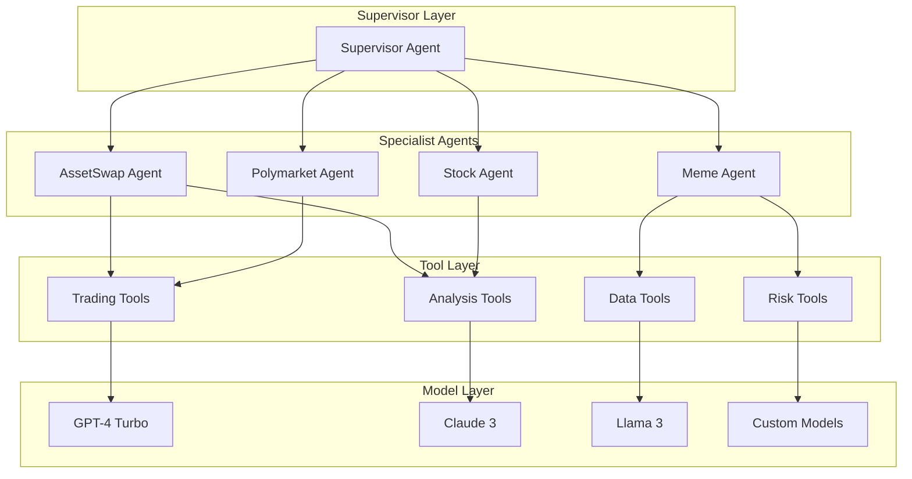

# AI System

## Overview

AssetSwap's AI system represents a quantum leap in automated trading intelligence, leveraging state-of-the-art language models, multi-agent architectures, and continuous learning mechanisms. Our system doesn't just execute trades—it understands market dynamics, learns from patterns, and evolves its strategies based on real-world performance.

## Multi-Agent Architecture

### Agent Hierarchy



### Supervisor Agent

The Supervisor Agent acts as the central coordinator, implementing a sophisticated routing mechanism:

```javascript
class SupervisorAgent {
    constructor() {
        this.intentClassifier = new IntentClassificationModel();
        this.contextManager = new ContextManager();
        this.performanceTracker = new PerformanceTracker();
    }
    
    async route(message, context) {
        // Step 1: Intent Classification
        const intent = await this.intentClassifier.classify(message);
        
        // Step 2: Context Enrichment
        const enrichedContext = await this.contextManager.enrich(
            context,
            intent
        );
        
        // Step 3: Agent Selection
        const selectedAgent = this.selectOptimalAgent(
            intent,
            enrichedContext
        );
        
        // Step 4: Performance Monitoring
        const startTime = Date.now();
        const response = await selectedAgent.process(
            message,
            enrichedContext
        );
        
        await this.performanceTracker.record({
            agent: selectedAgent.name,
            latency: Date.now() - startTime,
            success: response.success,
            intent
        });
        
        return response;
    }
    
    selectOptimalAgent(intent, context) {
        // Dynamic agent selection based on:
        // 1. Intent type
        // 2. Historical performance
        // 3. Current load
        // 4. User preferences
        
        const scores = this.agents.map(agent => ({
            agent,
            score: this.calculateAgentScore(agent, intent, context)
        }));
        
        return scores.sort((a, b) => b.score - a.score)[0].agent;
    }
}
```

## Specialized Trading Agents

### AssetSwap Agent (General Trading)

The primary agent handling comprehensive trading operations:

#### Capabilities
- **Market Analysis**: Real-time technical and fundamental analysis
- **Portfolio Management**: Automated rebalancing and optimization
- **Risk Assessment**: Dynamic risk scoring and mitigation
- **Strategy Execution**: Implementation of complex trading strategies

#### Tool Integration

```javascript
const assetswapTools = [
    // Trading Tools
    swapTokenTool,           // Execute token swaps
    limitOrderTool,          // Place limit orders
    stopLossTool,           // Set stop-loss orders
    takeProfitTool,         // Set take-profit orders
    
    // Analysis Tools
    technicalAnalysisTool,  // Chart patterns, indicators
    fundamentalAnalysisTool, // Token metrics, fundamentals
    sentimentAnalysisTool,   // Social sentiment analysis
    
    // Portfolio Tools
    portfolioBalanceTool,    // View portfolio composition
    rebalanceTool,          // Automatic rebalancing
    performanceTool,        // Track performance metrics
    
    // Risk Tools
    riskAssessmentTool,     // Evaluate position risk
    exposureAnalysisTool,   // Check market exposure
    hedgingTool            // Implement hedge strategies
];
```

### Meme Token Specialist

Dedicated agent for high-risk, high-reward meme token trading:

#### Unique Features

**Virality Detection Algorithm**
```python
class ViralityDetector:
    def calculate_virality_score(self, token):
        scores = {
            'social_momentum': self.social_momentum_score(token),
            'holder_growth': self.holder_growth_score(token),
            'influencer_mentions': self.influencer_score(token),
            'meme_quality': self.meme_quality_score(token),
            'community_engagement': self.engagement_score(token)
        }
        
        # Weighted average with time decay
        weights = {
            'social_momentum': 0.3,
            'holder_growth': 0.25,
            'influencer_mentions': 0.2,
            'meme_quality': 0.15,
            'community_engagement': 0.1
        }
        
        virality_score = sum(
            scores[metric] * weight 
            for metric, weight in weights.items()
        )
        
        return virality_score * self.time_decay_factor()
```

**Rug Pull Detection**
```javascript
class RugPullDetector {
    async analyzeToken(tokenAddress) {
        const risks = {
            liquidityLocked: await this.checkLiquidityLock(tokenAddress),
            ownershipRenounced: await this.checkOwnership(tokenAddress),
            honeypotRisk: await this.checkHoneypot(tokenAddress),
            holderConcentration: await this.analyzeHolders(tokenAddress),
            contractVerified: await this.checkVerification(tokenAddress)
        };
        
        const riskScore = this.calculateRiskScore(risks);
        
        return {
            score: riskScore,
            risks: risks,
            recommendation: this.getRiskRecommendation(riskScore)
        };
    }
}
```

### Polymarket Agent

Specialized in prediction market operations:

#### Core Functionality

**Probability Calculation Engine**
```python
class ProbabilityEngine:
    def calculate_true_probability(self, market):
        # Aggregate multiple data sources
        sources = [
            self.polling_data(market.question),
            self.expert_predictions(market.question),
            self.historical_accuracy(market.category),
            self.sentiment_analysis(market.question),
            self.statistical_models(market.data)
        ]
        
        # Bayesian inference for probability estimation
        prior = self.get_prior_probability(market)
        likelihood = self.calculate_likelihood(sources)
        
        posterior = (likelihood * prior) / self.normalization_constant
        
        return {
            'probability': posterior,
            'confidence': self.calculate_confidence(sources),
            'edge': posterior - market.current_probability
        }
```

**Arbitrage Detection**
```javascript
async function detectArbitrage() {
    const opportunities = [];
    
    // Check cross-platform arbitrage
    const polymarketOdds = await getPolymarketOdds();
    const otherPlatforms = await getOtherPlatformOdds();
    
    for (const market of polymarketOdds) {
        const equivalents = findEquivalentMarkets(market, otherPlatforms);
        
        for (const equivalent of equivalents) {
            const spread = Math.abs(market.probability - equivalent.probability);
            
            if (spread > MIN_ARBITRAGE_SPREAD) {
                opportunities.push({
                    market1: market,
                    market2: equivalent,
                    spread: spread,
                    expectedProfit: calculateExpectedProfit(spread)
                });
            }
        }
    }
    
    return opportunities.sort((a, b) => b.expectedProfit - a.expectedProfit);
}
```

## LangChain Integration

### Graph-Based Workflow

AssetSwap utilizes LangGraph for complex, multi-step workflows:

```javascript
import { StateGraph } from '@langchain/langgraph';

const tradingWorkflow = new StateGraph(StateAnnotation)
    .addNode('analyze', analyzeMarketNode)
    .addNode('strategize', createStrategyNode)
    .addNode('validate', validateStrategyNode)
    .addNode('execute', executeTradeNode)
    .addNode('monitor', monitorPositionNode)
    
    .addEdge('__start__', 'analyze')
    .addEdge('analyze', 'strategize')
    .addConditionalEdges('strategize', shouldProceed, {
        'continue': 'validate',
        'abort': '__end__'
    })
    .addEdge('validate', 'execute')
    .addEdge('execute', 'monitor')
    .addConditionalEdges('monitor', checkExit, {
        'hold': 'monitor',
        'exit': '__end__'
    });

const compiledWorkflow = tradingWorkflow.compile({
    checkpointer: mongoCheckpointer,
    recursionLimit: 50
});
```

### Memory Management

Long-term memory for context retention:

```javascript
class MemoryManager {
    constructor() {
        this.shortTermMemory = new ShortTermMemory(100); // Last 100 messages
        this.longTermMemory = new VectorMemory();        // Semantic search
        this.episodicMemory = new EpisodicMemory();      // Trading episodes
    }
    
    async store(interaction) {
        // Store in short-term memory
        this.shortTermMemory.add(interaction);
        
        // Generate embeddings for long-term storage
        const embedding = await this.generateEmbedding(interaction);
        await this.longTermMemory.store(embedding, interaction);
        
        // Extract and store trading episodes
        if (this.isTradingEpisode(interaction)) {
            await this.episodicMemory.store(interaction);
        }
    }
    
    async retrieve(query, context) {
        // Combine different memory types
        const recent = this.shortTermMemory.getRecent(10);
        const relevant = await this.longTermMemory.search(query, 5);
        const similar = await this.episodicMemory.findSimilar(context, 3);
        
        return this.combineMemories(recent, relevant, similar);
    }
}
```

### Tool Framework

Extensible tool system for agent capabilities:

```javascript
import { tool } from '@langchain/core/tools';
import { z } from 'zod';

const swapTokenTool = tool(
    async ({ inputToken, outputToken, amount, slippage }, { configurable }) => {
        const user = configurable?.user;
        const wallet = await getWallet(user.id);
        
        try {
            const result = await jupiterService.swap({
                wallet,
                inputMint: await resolveToken(inputToken),
                outputMint: await resolveToken(outputToken),
                amount: parseAmount(amount),
                slippageBps: slippage * 100
            });
            
            return {
                success: true,
                txHash: result.signature,
                inputAmount: result.inputAmount,
                outputAmount: result.outputAmount,
                priceImpact: result.priceImpact
            };
        } catch (error) {
            return {
                success: false,
                error: error.message
            };
        }
    },
    {
        name: 'swap_tokens',
        description: 'Execute a token swap on Solana',
        schema: z.object({
            inputToken: z.string().describe('Input token symbol or address'),
            outputToken: z.string().describe('Output token symbol or address'),
            amount: z.number().describe('Amount to swap'),
            slippage: z.number().default(5).describe('Slippage tolerance %')
        })
    }
);
```

## Machine Learning Models

### Custom Trading Models

#### Price Prediction Model

```python
class PricePredictionModel(nn.Module):
    def __init__(self, input_dim=200, hidden_dim=512, num_layers=4):
        super().__init__()
        
        # Transformer encoder for sequence modeling
        self.transformer = nn.TransformerEncoder(
            nn.TransformerEncoderLayer(
                d_model=input_dim,
                nhead=8,
                dim_feedforward=hidden_dim,
                dropout=0.1
            ),
            num_layers=num_layers
        )
        
        # Attention mechanism for feature importance
        self.attention = nn.MultiheadAttention(
            embed_dim=input_dim,
            num_heads=8
        )
        
        # Output layers
        self.fc1 = nn.Linear(input_dim, hidden_dim)
        self.fc2 = nn.Linear(hidden_dim, 3)  # [down, neutral, up]
        
    def forward(self, x):
        # x shape: (seq_len, batch, features)
        
        # Self-attention on the sequence
        transformer_out = self.transformer(x)
        
        # Global attention pooling
        attn_out, _ = self.attention(
            transformer_out,
            transformer_out,
            transformer_out
        )
        
        # Classification head
        pooled = torch.mean(attn_out, dim=0)
        hidden = F.relu(self.fc1(pooled))
        output = F.softmax(self.fc2(hidden), dim=-1)
        
        return output
```

#### Risk Assessment Model

```python
class RiskAssessmentNetwork:
    def __init__(self):
        self.model = self.build_model()
        self.scaler = StandardScaler()
        
    def build_model(self):
        return Pipeline([
            ('scaler', StandardScaler()),
            ('feature_selection', SelectKBest(k=50)),
            ('classifier', XGBClassifier(
                n_estimators=200,
                max_depth=10,
                learning_rate=0.01,
                objective='multi:softprob'
            ))
        ])
    
    def extract_features(self, token_data):
        features = {
            # Liquidity metrics
            'liquidity_depth': token_data.get('liquidity', 0),
            'liquidity_locked_percent': token_data.get('locked_liquidity', 0),
            
            # Holder metrics
            'holder_count': token_data.get('holders', 0),
            'whale_concentration': token_data.get('top10_percent', 0),
            'holder_growth_rate': token_data.get('holder_growth', 0),
            
            # Trading metrics
            'volume_24h': token_data.get('volume_24h', 0),
            'price_volatility': token_data.get('volatility', 0),
            'buy_sell_ratio': token_data.get('buy_ratio', 0),
            
            # Smart contract metrics
            'contract_verified': int(token_data.get('verified', False)),
            'ownership_renounced': int(token_data.get('renounced', False)),
            'mint_disabled': int(token_data.get('mint_disabled', False)),
            
            # Social metrics
            'social_score': token_data.get('social_score', 0),
            'sentiment_score': token_data.get('sentiment', 0)
        }
        
        return np.array(list(features.values())).reshape(1, -1)
    
    def predict_risk(self, token_data):
        features = self.extract_features(token_data)
        risk_probabilities = self.model.predict_proba(features)[0]
        
        risk_levels = ['low', 'medium', 'high', 'extreme']
        risk_scores = dict(zip(risk_levels, risk_probabilities))
        
        return {
            'risk_level': max(risk_scores, key=risk_scores.get),
            'scores': risk_scores,
            'recommendation': self.get_recommendation(risk_scores)
        }
```

### Reinforcement Learning

#### Trading Strategy Optimization

```python
class TradingEnvironment(gym.Env):
    def __init__(self, market_data, initial_balance=10000):
        super().__init__()
        
        self.market_data = market_data
        self.initial_balance = initial_balance
        
        # Action space: [hold, buy_25%, buy_50%, buy_75%, sell_25%, sell_50%, sell_75%]
        self.action_space = spaces.Discrete(7)
        
        # Observation space: price, volume, indicators, portfolio state
        self.observation_space = spaces.Box(
            low=-np.inf,
            high=np.inf,
            shape=(50,),
            dtype=np.float32
        )
        
        self.reset()
    
    def step(self, action):
        # Execute action
        reward = self.execute_action(action)
        
        # Update state
        self.current_step += 1
        done = self.current_step >= len(self.market_data) - 1
        
        # Calculate reward
        portfolio_value = self.calculate_portfolio_value()
        reward = (portfolio_value - self.previous_value) / self.previous_value
        
        # Apply risk-adjusted reward
        sharpe_ratio = self.calculate_sharpe_ratio()
        reward = reward * sharpe_ratio
        
        self.previous_value = portfolio_value
        
        return self.get_observation(), reward, done, {}
    
    def train_agent(self):
        model = PPO(
            'MlpPolicy',
            self,
            learning_rate=3e-4,
            n_steps=2048,
            batch_size=64,
            n_epochs=10,
            gamma=0.99,
            gae_lambda=0.95,
            clip_range=0.2,
            verbose=1
        )
        
        model.learn(total_timesteps=1000000)
        return model
```

## Natural Language Processing

### Intent Classification

Multi-class intent classification for user queries:

```python
class IntentClassifier:
    def __init__(self):
        self.model = AutoModelForSequenceClassification.from_pretrained(
            'assetswap/intent-classifier-v2'
        )
        self.tokenizer = AutoTokenizer.from_pretrained(
            'assetswap/intent-classifier-v2'
        )
        
        self.intent_categories = [
            'trade_execution',
            'market_analysis',
            'portfolio_management',
            'risk_assessment',
            'education',
            'account_management',
            'technical_support'
        ]
    
    def classify(self, text):
        inputs = self.tokenizer(
            text,
            return_tensors='pt',
            truncation=True,
            padding=True,
            max_length=512
        )
        
        with torch.no_grad():
            outputs = self.model(**inputs)
            probabilities = torch.softmax(outputs.logits, dim=-1)
        
        intent_scores = {
            intent: prob.item()
            for intent, prob in zip(self.intent_categories, probabilities[0])
        }
        
        return {
            'primary_intent': max(intent_scores, key=intent_scores.get),
            'scores': intent_scores,
            'confidence': max(intent_scores.values())
        }
```

### Entity Recognition

Custom NER for financial entities:

```python
class FinancialNER:
    def __init__(self):
        self.model = self.load_model()
        
        self.entity_types = {
            'TOKEN': 'cryptocurrency token',
            'AMOUNT': 'transaction amount',
            'PRICE': 'price value',
            'PERCENTAGE': 'percentage value',
            'TIME': 'time period',
            'WALLET': 'wallet address',
            'EXCHANGE': 'exchange name'
        }
    
    def extract_entities(self, text):
        doc = self.model(text)
        
        entities = []
        for ent in doc.ents:
            if ent.label_ in self.entity_types:
                entities.append({
                    'text': ent.text,
                    'type': ent.label_,
                    'start': ent.start_char,
                    'end': ent.end_char,
                    'description': self.entity_types[ent.label_]
                })
        
        # Post-processing for token resolution
        for entity in entities:
            if entity['type'] == 'TOKEN':
                entity['resolved'] = self.resolve_token(entity['text'])
        
        return entities
```

## Continuous Learning

### Feedback Loop

```javascript
class LearningSystem {
    async recordOutcome(prediction, actual, context) {
        // Store prediction and outcome
        await this.database.store({
            timestamp: new Date(),
            prediction: prediction,
            actual: actual,
            context: context,
            accuracy: this.calculateAccuracy(prediction, actual)
        });
        
        // Update model performance metrics
        await this.updateMetrics(prediction, actual);
        
        // Trigger retraining if performance degrades
        if (await this.shouldRetrain()) {
            await this.scheduleRetraining();
        }
    }
    
    async retrain() {
        // Gather recent data
        const trainingData = await this.database.getRecentData(30); // 30 days
        
        // Prepare features and labels
        const { features, labels } = this.prepareData(trainingData);
        
        // Fine-tune model
        const newModel = await this.fineTuneModel(
            this.currentModel,
            features,
            labels
        );
        
        // A/B test new model
        const testResults = await this.abTest(
            this.currentModel,
            newModel
        );
        
        // Deploy if improved
        if (testResults.newModelBetter) {
            await this.deployModel(newModel);
        }
    }
}
```

### Performance Monitoring

Real-time monitoring of AI performance:

```python
class AIMonitor:
    def __init__(self):
        self.metrics = {
            'response_time': [],
            'accuracy': [],
            'user_satisfaction': [],
            'trade_success_rate': [],
            'prediction_accuracy': []
        }
        
    def track_performance(self):
        return {
            'avg_response_time': np.mean(self.metrics['response_time']),
            'accuracy_trend': self.calculate_trend(self.metrics['accuracy']),
            'satisfaction_score': np.mean(self.metrics['user_satisfaction']),
            'trade_success': np.mean(self.metrics['trade_success_rate']),
            'prediction_mae': self.calculate_mae(self.metrics['prediction_accuracy'])
        }
    
    def generate_report(self):
        performance = self.track_performance()
        
        report = {
            'timestamp': datetime.now(),
            'performance': performance,
            'alerts': self.check_alerts(performance),
            'recommendations': self.generate_recommendations(performance)
        }
        
        return report
```

## Conclusion

AssetSwap's AI system represents the pinnacle of artificial intelligence applied to decentralized trading. Through our multi-agent architecture, sophisticated machine learning models, and continuous learning mechanisms, we provide users with an intelligent trading companion that learns, adapts, and improves over time.

The integration of LangChain enables complex reasoning and decision-making, while our custom models provide specialized capabilities for price prediction, risk assessment, and strategy optimization. This comprehensive AI infrastructure ensures that every user, regardless of their expertise level, can trade with the intelligence of a seasoned professional.

As the system continues to learn from millions of interactions and trades, it becomes increasingly sophisticated, creating a virtuous cycle of improvement that benefits all users of the AssetSwap protocol.

---

*Continue to [Trading Mechanisms](trading-mechanisms.md) →*