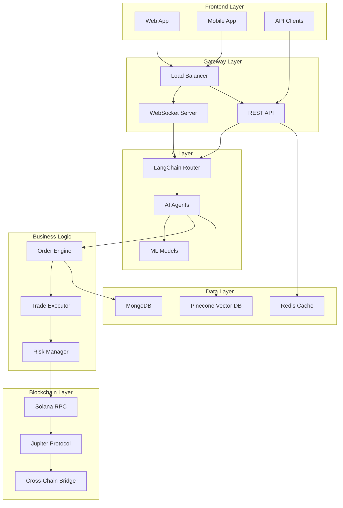

# Architecture

## System Overview

AssetSwap's architecture represents a breakthrough in decentralized trading infrastructure, seamlessly integrating artificial intelligence, blockchain technology, and traditional financial systems into a unified platform. Our modular, microservices-based design ensures scalability, reliability, and maintainability while delivering sub-second response times.

## High-Level Architecture



## Core Components

### 1. Frontend Layer

#### Web Application
- **Technology**: Next.js 14 with TypeScript
- **Features**:
  - Real-time market data streaming
  - Interactive charting with TradingView
  - Drag-and-drop strategy builder
  - Social trading dashboard
- **Performance**:
  - Server-side rendering for SEO
  - Code splitting for optimal load times
  - Progressive Web App capabilities

#### Mobile Applications
- **Technology**: React Native
- **Platforms**: iOS, Android
- **Features**:
  - Biometric authentication
  - Push notifications for trade alerts
  - Offline transaction signing
  - Hardware wallet integration

#### API Gateway
- **Protocol**: REST and GraphQL
- **Authentication**: JWT with refresh tokens
- **Rate Limiting**: 1000 requests/minute per user
- **Documentation**: OpenAPI 3.0 specification

### 2. AI Engine Layer

#### LangChain Router
The central nervous system of AssetSwap's AI infrastructure:

```javascript
// Simplified Router Architecture
class IntelligentRouter {
    constructor() {
        this.agents = {
            'assetswap': GeneralTradingAgent,
            'meme': MemeTokenSpecialist,
            'polymarket': PredictionMarketAgent,
            'stock': EquityTokenAgent,
            'admin': AdministrativeAgent
        };
        
        this.intentClassifier = new IntentClassificationModel();
        this.contextManager = new ConversationContextManager();
    }
    
    async route(userInput, context) {
        const intent = await this.intentClassifier.classify(userInput);
        const agent = this.selectAgent(intent, context);
        const enrichedContext = await this.contextManager.enrich(context);
        return await agent.process(userInput, enrichedContext);
    }
}
```

#### Specialized AI Agents

**AssetSwap Agent (General Trading)**
- Handles general trading queries and operations
- Integrates with all trading tools
- Manages portfolio optimization
- Provides market analysis

**Meme Token Specialist**
- Analyzes social sentiment and virality metrics
- Identifies emerging meme tokens
- Calculates risk scores for speculative assets
- Monitors holder distribution patterns

**Polymarket Agent**
- Interfaces with prediction markets
- Calculates probability-adjusted returns
- Executes hedge strategies
- Provides event-driven trading signals

**Stock Token Agent**
- Manages tokenized equity positions
- Provides fundamental analysis
- Executes traditional trading strategies
- Handles regulatory compliance checks

### 3. Order Management System

#### Order Engine Architecture

```typescript
interface Order {
    id: string;
    userId: string;
    walletAddress: string;
    orderType: OrderType;
    status: OrderStatus;
    tokenMint: string;
    amount: number;
    triggerType: TriggerType;
    triggerValue: number;
    slippage: number;
    expiresAt: Date;
}

enum TriggerType {
    // Price Triggers
    PRICE_ABOVE = 'price_above',
    PRICE_BELOW = 'price_below',
    
    // Score Triggers (AI-Powered)
    SECURITY_SCORE_ABOVE = 'security_score_above',
    LIQUIDITY_SCORE_BELOW = 'liquidity_score_below',
    MOMENTUM_SCORE_ABOVE = 'momentum_score_above',
    
    // Market Data Triggers
    MARKET_CAP_ABOVE = 'market_cap_above',
    VOLUME_ABOVE = 'volume_above',
    HOLDERS_ABOVE = 'holders_above',
    
    // Advanced Triggers
    WHALE_ACCUMULATION = 'whale_accumulation',
    SOCIAL_SENTIMENT_POSITIVE = 'social_sentiment_positive',
    TECHNICAL_BREAKOUT = 'technical_breakout'
}
```

#### Trigger Evaluation Service

The trigger service continuously monitors market conditions:

```javascript
class TriggerEvaluationService {
    constructor() {
        this.pollingInterval = 1000; // 1 second
        this.batchSize = 100;
        this.evaluators = new Map();
        this.initializeEvaluators();
    }
    
    async evaluateOrders() {
        const activeOrders = await Order.find({ 
            status: 'active',
            expiresAt: { $gt: new Date() }
        }).limit(this.batchSize);
        
        const evaluationPromises = activeOrders.map(order => 
            this.evaluateOrder(order)
        );
        
        const results = await Promise.allSettled(evaluationPromises);
        await this.processResults(results);
    }
    
    async evaluateOrder(order) {
        const evaluator = this.evaluators.get(order.triggerType);
        const currentValue = await evaluator.getCurrentValue(order);
        
        if (evaluator.shouldTrigger(currentValue, order.triggerValue)) {
            await this.executeOrder(order);
        }
    }
}
```

### 4. Trading Execution Layer

#### Jupiter Integration

AssetSwap leverages Jupiter Protocol for optimal trade execution:

```javascript
class JupiterTradingService {
    async executeTrade(params) {
        // Step 1: Balance validation
        const balance = await this.checkBalance(params.wallet);
        
        // Step 2: Route calculation
        const route = await this.findOptimalRoute({
            inputMint: params.inputMint,
            outputMint: params.outputMint,
            amount: params.amount,
            slippageBps: params.slippage * 100
        });
        
        // Step 3: Fee calculation and sponsorship check
        const fees = await this.calculateFees(route);
        const sponsorship = await this.checkSponsorship(
            params.user,
            fees.network
        );
        
        // Step 4: Transaction construction
        const transaction = await this.buildTransaction(
            route,
            fees,
            sponsorship
        );
        
        // Step 5: Signature and execution
        const signature = await this.signAndSend(
            transaction,
            params.wallet
        );
        
        return {
            signature,
            inputAmount: params.amount,
            outputAmount: route.outAmount,
            priceImpact: route.priceImpact,
            fees
        };
    }
}
```

#### Smart Order Router

Our proprietary routing algorithm optimizes for:
- **Price Impact Minimization**: Splits large orders across pools
- **Fee Optimization**: Considers both network and protocol fees
- **MEV Protection**: Implements commit-reveal schemes
- **Slippage Protection**: Dynamic slippage adjustment

### 5. Blockchain Integration

#### Multi-Chain Architecture

```typescript
abstract class BlockchainConnector {
    abstract async getBalance(address: string): Promise<bigint>;
    abstract async sendTransaction(tx: Transaction): Promise<string>;
    abstract async estimateGas(tx: Transaction): Promise<bigint>;
}

class SolanaConnector extends BlockchainConnector {
    private connection: Connection;
    
    async sendTransaction(tx: Transaction): Promise<string> {
        const signature = await this.connection.sendRawTransaction(
            tx.serialize(),
            {
                skipPreflight: false,
                preflightCommitment: 'confirmed',
                maxRetries: 3
            }
        );
        return signature;
    }
}

class EVMConnector extends BlockchainConnector {
    private provider: ethers.Provider;
    
    async sendTransaction(tx: Transaction): Promise<string> {
        const response = await this.provider.sendTransaction(tx);
        const receipt = await response.wait();
        return receipt.hash;
    }
}
```

#### Cross-Chain Bridge Integration

Seamless asset movement between chains:
- **Wormhole Protocol**: For Solana ↔ EVM transfers
- **Atomic Swaps**: For trustless cross-chain trades
- **Liquidity Pools**: Maintained on both sides of bridges
- **Fee Abstraction**: Users pay in any token

### 6. Data Management Layer

#### Database Architecture

**MongoDB (Primary Database)**
- **Collections**:
  - users: User profiles and settings
  - orders: All order types and states
  - transactions: Historical trade data
  - conversations: AI chat history
  - memes: Token metadata and metrics

**Redis (Caching Layer)**
- **Use Cases**:
  - Session management
  - Rate limiting counters
  - Hot data caching
  - Real-time price feeds
  - WebSocket connection state

**Pinecone (Vector Database)**
- **Applications**:
  - Semantic search for tokens
  - Similar trader discovery
  - Pattern matching for strategies
  - AI memory storage

#### Data Pipeline

```python
class MarketDataPipeline:
    def __init__(self):
        self.sources = [
            'jupiter_api',
            'coingecko',
            'dexscreener',
            'polygon_io',
            'social_feeds'
        ]
        self.processors = []
        self.storage = DataLake()
    
    async def ingest(self):
        """Continuously ingest data from all sources"""
        while True:
            tasks = [self.fetch_source(s) for s in self.sources]
            data = await asyncio.gather(*tasks)
            
            processed = await self.process(data)
            await self.storage.write(processed)
            
            await asyncio.sleep(1)  # 1 second intervals
    
    async def process(self, raw_data):
        """Apply transformations and enrichments"""
        for processor in self.processors:
            raw_data = await processor.transform(raw_data)
        return raw_data
```

### 7. Security Architecture

#### Encryption Service

```javascript
class EncryptionService {
    constructor() {
        this.kms = new GoogleCloudKMS();
        this.algorithm = 'aes-256-gcm';
        this.keyRotationInterval = 30 * 24 * 60 * 60 * 1000; // 30 days
    }
    
    async encryptPrivateKey(privateKey, userId) {
        // Generate user-specific encryption key
        const userKey = await this.kms.generateDataKey(userId);
        
        // Encrypt private key with AES-256-GCM
        const iv = crypto.randomBytes(16);
        const cipher = crypto.createCipheriv(
            this.algorithm,
            userKey.plaintext,
            iv
        );
        
        const encrypted = Buffer.concat([
            cipher.update(privateKey),
            cipher.final()
        ]);
        
        const authTag = cipher.getAuthTag();
        
        // Store encrypted key with metadata
        return {
            encrypted: encrypted.toString('base64'),
            iv: iv.toString('base64'),
            authTag: authTag.toString('base64'),
            keyId: userKey.ciphertextBlob,
            algorithm: this.algorithm,
            rotateAt: new Date(Date.now() + this.keyRotationInterval)
        };
    }
}
```

#### Access Control

Multi-layer security model:
- **Authentication**: JWT with refresh tokens
- **Authorization**: Role-based access control (RBAC)
- **Encryption**: End-to-end encryption for sensitive data
- **Audit**: Comprehensive logging of all operations
- **Monitoring**: Real-time anomaly detection

### 8. Performance Optimization

#### Caching Strategy

Multi-tier caching for optimal performance:

```javascript
class CacheManager {
    constructor() {
        this.l1Cache = new MemoryCache();  // In-memory (10ms)
        this.l2Cache = new RedisCache();   // Redis (50ms)
        this.l3Cache = new CDNCache();     // CDN (200ms)
    }
    
    async get(key) {
        // Try L1 cache first
        let value = await this.l1Cache.get(key);
        if (value) return { value, source: 'L1' };
        
        // Try L2 cache
        value = await this.l2Cache.get(key);
        if (value) {
            await this.l1Cache.set(key, value);
            return { value, source: 'L2' };
        }
        
        // Try L3 cache
        value = await this.l3Cache.get(key);
        if (value) {
            await this.l2Cache.set(key, value);
            await this.l1Cache.set(key, value);
            return { value, source: 'L3' };
        }
        
        return null;
    }
}
```

#### Load Balancing

Distributed load handling:
- **Geographic Distribution**: Edge nodes in 5 regions
- **Auto-scaling**: Kubernetes horizontal pod autoscaling
- **Circuit Breakers**: Prevent cascade failures
- **Rate Limiting**: Per-user and per-IP limits
- **Queue Management**: Priority queues for order execution

## Scalability Design

### Horizontal Scaling

All components designed for horizontal scaling:
- **Stateless Services**: No service maintains session state
- **Database Sharding**: MongoDB sharded by user ID
- **Queue Distribution**: Kafka for event streaming
- **Cache Partitioning**: Redis cluster with consistent hashing

### Performance Metrics

Current system capabilities:
- **Throughput**: 10,000 trades per second
- **Latency**: <50ms API response time (p99)
- **Availability**: 99.99% uptime SLA
- **Data Processing**: 1TB daily market data ingestion
- **Concurrent Users**: 100,000 simultaneous connections

## Deployment Architecture

### Infrastructure as Code

Complete infrastructure defined in Terraform:

```hcl
resource "google_container_cluster" "primary" {
  name     = "assetswap-primary"
  location = "us-central1"
  
  node_pool {
    name       = "default-pool"
    node_count = 3
    
    autoscaling {
      min_node_count = 3
      max_node_count = 100
    }
    
    node_config {
      machine_type = "n2-standard-16"
      
      oauth_scopes = [
        "https://www.googleapis.com/auth/cloud-platform"
      ]
    }
  }
}
```

### CI/CD Pipeline

Automated deployment process:
1. **Code Commit**: Push to GitHub
2. **Automated Tests**: Jest unit tests, Cypress E2E tests
3. **Security Scan**: Snyk vulnerability scanning
4. **Build**: Docker containerization
5. **Deploy**: Kubernetes rolling update
6. **Monitor**: Datadog APM monitoring

## Monitoring and Observability

### Metrics Collection

Comprehensive monitoring stack:
- **Application Metrics**: Custom metrics via Prometheus
- **Infrastructure Metrics**: Node, pod, and container metrics
- **Business Metrics**: Trade volume, success rates, user activity
- **AI Metrics**: Model performance, prediction accuracy

### Logging Architecture

Centralized logging with ELK stack:
- **Elasticsearch**: Log storage and indexing
- **Logstash**: Log processing and enrichment
- **Kibana**: Visualization and alerting
- **Structured Logging**: JSON format for all logs

### Distributed Tracing

End-to-end request tracing:
- **OpenTelemetry**: Instrumentation framework
- **Jaeger**: Distributed tracing backend
- **Correlation IDs**: Track requests across services
- **Performance Analysis**: Identify bottlenecks

## Conclusion

AssetSwap's architecture represents the convergence of cutting-edge technologies in AI, blockchain, and distributed systems. Our modular design ensures that each component can evolve independently while maintaining system integrity. This architecture not only supports current requirements but is designed to scale with the growing demands of the DeFi ecosystem.

The combination of intelligent agents, high-performance trading infrastructure, and robust security measures creates a platform that is both powerful for professionals and accessible for retail users. As we continue to innovate, this architecture will serve as the foundation for the next generation of decentralized finance.

---

*Continue to [AI System](ai-system.md) →*