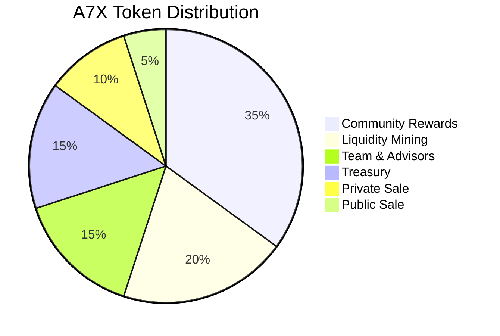

# Tokenomics

## Overview

The A7X token serves as the backbone of AssetSwap's economic model, aligning incentives between users, developers, liquidity providers, and governance participants. Our tokenomics design creates sustainable value accrual mechanisms while ensuring long-term protocol growth and decentralization.

## Token Specifications

### Technical Details

```javascript
const A7X_TOKEN = {
    name: "AssetSwap",
    symbol: "A7X",
    decimals: 9,
    blockchain: "Solana",
    tokenStandard: "SPL",
    totalSupply: "1,000,000,000", // 1 billion
    mintAddress: "A7X...placeholder", // To be deployed
    mintAuthority: "Revoked after distribution",
    freezeAuthority: "Revoked at launch"
};
```

### Token Distribution



#### Detailed Allocation

| Category | Allocation | Tokens | Vesting Schedule |
|----------|------------|--------|------------------|
| **Community Rewards** | 35% | 350,000,000 | Released over 5 years |
| **Liquidity Mining** | 20% | 200,000,000 | Released over 3 years |
| **Team & Advisors** | 15% | 150,000,000 | 4-year vest, 1-year cliff |
| **Treasury** | 15% | 150,000,000 | DAO controlled |
| **Private Sale** | 10% | 100,000,000 | 2-year vest, 6-month cliff |
| **Public Sale** | 5% | 50,000,000 | No vesting |

## Utility Model

### Core Utilities

#### 1. Trading Fee Discounts

```python
class FeeDiscountTiers:
    def calculate_discount(self, a7x_holdings):
        tiers = [
            {'min': 0, 'max': 1000, 'discount': 0},
            {'min': 1000, 'max': 10000, 'discount': 0.1},  # 10% discount
            {'min': 10000, 'max': 100000, 'discount': 0.25},  # 25% discount
            {'min': 100000, 'max': 1000000, 'discount': 0.5},  # 50% discount
            {'min': 1000000, 'max': float('inf'), 'discount': 0.75}  # 75% discount
        ]
        
        for tier in tiers:
            if tier['min'] <= a7x_holdings < tier['max']:
                return tier['discount']
        
        return 0
    
    def calculate_effective_fee(self, base_fee, a7x_holdings):
        discount = self.calculate_discount(a7x_holdings)
        effective_fee = base_fee * (1 - discount)
        
        return {
            'base_fee': base_fee,
            'discount': discount,
            'effective_fee': effective_fee,
            'savings': base_fee - effective_fee
        }
```

#### 2. Governance Rights

```javascript
class GovernanceRights {
    calculateVotingPower(stakedA7X, lockDuration) {
        // Base voting power = staked amount
        let votingPower = stakedA7X;
        
        // Time multiplier for longer lock periods
        const timeMultiplier = this.getTimeMultiplier(lockDuration);
        votingPower *= timeMultiplier;
        
        // Participation bonus for active voters
        const participationBonus = this.getParticipationBonus(userId);
        votingPower *= (1 + participationBonus);
        
        return Math.floor(votingPower);
    }
    
    getTimeMultiplier(lockDays) {
        if (lockDays < 30) return 1.0;
        if (lockDays < 90) return 1.25;
        if (lockDays < 180) return 1.5;
        if (lockDays < 365) return 2.0;
        return 2.5; // Maximum multiplier for 1+ year locks
    }
}
```

#### 3. Staking Rewards

```python
class StakingRewards:
    def __init__(self):
        self.base_apr = 0.15  # 15% base APR
        self.max_apr = 0.30   # 30% maximum APR
        
    def calculate_rewards(self, staked_amount, lock_period, total_staked):
        # Base reward calculation
        base_reward = staked_amount * self.base_apr
        
        # Lock period bonus
        lock_bonus = self.calculate_lock_bonus(lock_period)
        
        # Share of pool bonus (for large stakers)
        pool_share = staked_amount / total_staked
        pool_bonus = min(pool_share * 0.1, 0.05)  # Max 5% bonus
        
        # Calculate final APR
        final_apr = min(
            self.base_apr + lock_bonus + pool_bonus,
            self.max_apr
        )
        
        annual_rewards = staked_amount * final_apr
        
        return {
            'staked_amount': staked_amount,
            'lock_period': lock_period,
            'apr': final_apr,
            'annual_rewards': annual_rewards,
            'daily_rewards': annual_rewards / 365
        }
    
    def calculate_lock_bonus(self, days):
        bonuses = {
            30: 0.02,   # +2% APR
            90: 0.05,   # +5% APR
            180: 0.08,  # +8% APR
            365: 0.12   # +12% APR
        }
        
        for period, bonus in sorted(bonuses.items(), reverse=True):
            if days >= period:
                return bonus
        return 0
```

#### 4. Premium Features Access

```javascript
const PREMIUM_FEATURES = {
    tiers: [
        {
            name: 'Bronze',
            requiredA7X: 1000,
            features: [
                'Advanced charting tools',
                'Real-time alerts',
                'API access (1000 calls/day)'
            ]
        },
        {
            name: 'Silver',
            requiredA7X: 10000,
            features: [
                'All Bronze features',
                'AI trading signals',
                'Custom strategies',
                'API access (10000 calls/day)',
                'Priority customer support'
            ]
        },
        {
            name: 'Gold',
            requiredA7X: 100000,
            features: [
                'All Silver features',
                'Institutional tools',
                'White-label options',
                'Unlimited API access',
                'Dedicated account manager',
                'Custom AI agent training'
            ]
        },
        {
            name: 'Platinum',
            requiredA7X: 1000000,
            features: [
                'All Gold features',
                'Direct market access',
                'Custom liquidity pools',
                'Revenue sharing (0.1% of protocol fees)',
                'Governance proposal rights',
                'Early access to new features'
            ]
        }
    ]
};
```

## Revenue Model

### Fee Structure

```python
class RevenueModel:
    def __init__(self):
        self.fee_structure = {
            'spot_trading': 0.002,      # 0.2% per trade
            'limit_orders': 0.001,       # 0.1% per order
            'ai_agent_usage': 0.0005,    # 0.05% per AI interaction
            'cross_chain_bridge': 0.003,  # 0.3% bridge fee
            'liquidity_provision': 0.0001 # 0.01% LP fee
        }
        
    def distribute_revenue(self, total_fees):
        distribution = {
            'a7x_stakers': total_fees * 0.40,      # 40% to stakers
            'liquidity_providers': total_fees * 0.25,  # 25% to LPs
            'treasury': total_fees * 0.20,         # 20% to treasury
            'buyback_burn': total_fees * 0.10,     # 10% for buyback & burn
            'development': total_fees * 0.05        # 5% for development
        }
        
        return distribution
    
    def calculate_apr_for_stakers(self, daily_fees, total_staked_value):
        daily_staker_revenue = daily_fees * 0.40
        daily_return = daily_staker_revenue / total_staked_value
        annual_return = daily_return * 365
        
        return {
            'daily_revenue': daily_staker_revenue,
            'daily_return': daily_return,
            'apr': annual_return,
            'apy': (1 + daily_return) ** 365 - 1
        }
```

### Buyback and Burn Mechanism

```javascript
class BuybackAndBurn {
    constructor() {
        this.buybackWallet = 'BBWallet...';
        this.burnAddress = '11111111111111111111111111111111';
        this.minBuybackAmount = 10000; // $10,000 USD minimum
    }
    
    async executeBuyback() {
        const treasuryBalance = await this.getTreasuryBalance();
        const buybackAmount = treasuryBalance * 0.10; // 10% of fees
        
        if (buybackAmount < this.minBuybackAmount) {
            return { executed: false, reason: 'Below minimum threshold' };
        }
        
        // Execute market buy of A7X tokens
        const purchasedTokens = await this.marketBuy({
            amount: buybackAmount,
            token: 'A7X',
            maxSlippage: 0.02 // 2% max slippage
        });
        
        // Burn purchased tokens
        const burnTx = await this.burnTokens({
            amount: purchasedTokens,
            verificationHash: this.generateBurnProof(purchasedTokens)
        });
        
        // Record for transparency
        await this.recordBuybackBurn({
            timestamp: Date.now(),
            usdAmount: buybackAmount,
            tokensAmount: purchasedTokens,
            burnTx: burnTx,
            priceImpact: this.calculatePriceImpact(buybackAmount)
        });
        
        return {
            executed: true,
            tokensBurned: purchasedTokens,
            txHash: burnTx
        };
    }
}
```

## Mining and Rewards

### Liquidity Mining Program

```python
class LiquidityMining:
    def __init__(self):
        self.total_allocation = 200_000_000  # 200M A7X
        self.distribution_period = 3 * 365    # 3 years in days
        self.daily_emissions = self.total_allocation / self.distribution_period
        
        # Pool weights determine reward distribution
        self.pool_weights = {
            'A7X/USDC': 0.30,
            'A7X/SOL': 0.25,
            'SOL/USDC': 0.15,
            'ETH/USDC': 0.10,
            'BTC/USDC': 0.10,
            'OTHER': 0.10
        }
    
    def calculate_rewards(self, pool_id, user_liquidity, total_pool_liquidity):
        pool_weight = self.pool_weights.get(pool_id, 0.01)
        pool_daily_rewards = self.daily_emissions * pool_weight
        
        user_share = user_liquidity / total_pool_liquidity
        user_daily_rewards = pool_daily_rewards * user_share
        
        # Boost for long-term providers
        time_multiplier = self.get_time_multiplier(user_deposit_time)
        boosted_rewards = user_daily_rewards * time_multiplier
        
        return {
            'pool': pool_id,
            'user_share': user_share,
            'base_rewards': user_daily_rewards,
            'multiplier': time_multiplier,
            'final_rewards': boosted_rewards,
            'apr': (boosted_rewards * 365) / user_liquidity
        }
    
    def get_time_multiplier(self, days_provided):
        if days_provided < 7: return 1.0
        if days_provided < 30: return 1.1
        if days_provided < 90: return 1.25
        if days_provided < 180: return 1.5
        return 2.0  # Maximum 2x multiplier
```

### Trading Rewards

```javascript
class TradingRewards {
    calculateMiningRewards(user, tradingVolume) {
        const baseReward = tradingVolume * 0.0001; // 0.01% of volume
        
        // Tier multipliers based on monthly volume
        const tierMultiplier = this.getTierMultiplier(user.monthlyVolume);
        
        // Streak bonus for consecutive daily trading
        const streakBonus = this.getStreakBonus(user.tradingStreak);
        
        // New user bonus (first 30 days)
        const newUserBonus = this.getNewUserBonus(user.accountAge);
        
        const finalReward = baseReward * tierMultiplier * streakBonus * newUserBonus;
        
        return {
            baseReward,
            tierMultiplier,
            streakBonus,
            newUserBonus,
            finalReward,
            paidIn: 'A7X'
        };
    }
    
    getTierMultiplier(monthlyVolume) {
        if (monthlyVolume < 10000) return 1.0;
        if (monthlyVolume < 100000) return 1.5;
        if (monthlyVolume < 1000000) return 2.0;
        if (monthlyVolume < 10000000) return 3.0;
        return 4.0; // Whale tier
    }
}
```

## Governance

### Decentralized Autonomous Organization (DAO)

```python
class AssetSwapDAO:
    def __init__(self):
        self.proposal_threshold = 100000  # 100k A7X to create proposal
        self.quorum = 0.04  # 4% of total supply must vote
        self.voting_period = 7 * 24 * 60 * 60  # 7 days
        
    def create_proposal(self, proposer, proposal):
        # Verify proposer has enough A7X
        if proposer.a7x_balance < self.proposal_threshold:
            raise InsufficientBalance("Need 100k A7X to create proposal")
        
        proposal_id = self.generate_proposal_id()
        
        self.proposals[proposal_id] = {
            'id': proposal_id,
            'proposer': proposer.address,
            'title': proposal.title,
            'description': proposal.description,
            'actions': proposal.actions,  # On-chain actions to execute
            'created_at': time.time(),
            'voting_ends': time.time() + self.voting_period,
            'votes_for': 0,
            'votes_against': 0,
            'status': 'active'
        }
        
        return proposal_id
    
    def vote(self, voter, proposal_id, support):
        voting_power = self.calculate_voting_power(voter)
        
        if support:
            self.proposals[proposal_id]['votes_for'] += voting_power
        else:
            self.proposals[proposal_id]['votes_against'] += voting_power
        
        # Record vote for transparency
        self.votes[proposal_id][voter.address] = {
            'support': support,
            'voting_power': voting_power,
            'timestamp': time.time()
        }
    
    def execute_proposal(self, proposal_id):
        proposal = self.proposals[proposal_id]
        
        # Check if voting period ended
        if time.time() < proposal['voting_ends']:
            raise ProposalStillActive("Voting period not ended")
        
        # Check quorum
        total_votes = proposal['votes_for'] + proposal['votes_against']
        if total_votes < self.total_supply * self.quorum:
            proposal['status'] = 'failed_quorum'
            return False
        
        # Check if passed
        if proposal['votes_for'] <= proposal['votes_against']:
            proposal['status'] = 'rejected'
            return False
        
        # Execute on-chain actions
        for action in proposal['actions']:
            self.execute_action(action)
        
        proposal['status'] = 'executed'
        return True
```

### Treasury Management

```javascript
class TreasuryManagement {
    constructor() {
        this.treasury = {
            A7X: 150_000_000,
            USDC: 0,
            SOL: 0,
            ETH: 0
        };
        
        this.allocationStrategy = {
            development: 0.30,
            marketing: 0.20,
            partnerships: 0.15,
            security: 0.10,
            reserves: 0.25
        };
    }
    
    async allocateFunds(category, amount, token) {
        // Require DAO approval for large allocations
        if (amount > 100000) {
            const proposal = await this.createTreasuryProposal({
                category,
                amount,
                token,
                justification: arguments[3]
            });
            
            const approved = await this.dao.vote(proposal);
            if (!approved) {
                throw new Error('Treasury allocation rejected by DAO');
            }
        }
        
        // Execute allocation
        await this.transfer({
            from: this.treasuryAddress,
            to: this.categoryWallets[category],
            amount,
            token
        });
        
        // Record for transparency
        await this.recordAllocation({
            category,
            amount,
            token,
            timestamp: Date.now(),
            approvalMethod: amount > 100000 ? 'DAO' : 'automatic'
        });
    }
}
```

## Token Economics Sustainability

### Inflation Control

```python
class InflationControl:
    def __init__(self):
        self.max_supply = 1_000_000_000
        self.circulating_supply = 0
        self.emission_rate = self.calculate_emission_curve()
        
    def calculate_emission_curve(self):
        """Decreasing emission rate over time"""
        year_1 = 100_000_000  # 100M tokens
        year_2 = 75_000_000   # 75M tokens
        year_3 = 50_000_000   # 50M tokens
        year_4 = 25_000_000   # 25M tokens
        year_5 = 10_000_000   # 10M tokens
        # After year 5: 2% annual inflation cap
        
        return {
            1: year_1,
            2: year_2,
            3: year_3,
            4: year_4,
            5: year_5,
            'steady_state': 0.02  # 2% inflation after year 5
        }
    
    def calculate_supply_at_time(self, years_elapsed):
        total_emitted = 0
        
        for year in range(1, min(6, int(years_elapsed) + 1)):
            if year <= 5:
                total_emitted += self.emission_rate[year]
            else:
                # Steady state inflation
                total_emitted += self.circulating_supply * self.emission_rate['steady_state']
        
        return min(total_emitted, self.max_supply)
```

### Value Accrual Mechanisms

```javascript
class ValueAccrual {
    mechanisms = [
        {
            name: 'Fee Distribution',
            description: 'Protocol fees distributed to stakers',
            value_driver: 'Increased trading volume → Higher staking APR'
        },
        {
            name: 'Buyback & Burn',
            description: 'Automatic token buyback and burning',
            value_driver: 'Reduces supply → Price appreciation'
        },
        {
            name: 'Utility Expansion',
            description: 'New features requiring A7X',
            value_driver: 'Increased demand → Price appreciation'
        },
        {
            name: 'Network Effects',
            description: 'More users → Better liquidity → More users',
            value_driver: 'Exponential growth in token utility'
        },
        {
            name: 'Governance Premium',
            description: 'Control over protocol direction',
            value_driver: 'Strategic value for large holders'
        }
    ];
    
    calculateIntrinsicValue() {
        const metrics = {
            dailyFees: this.getAverageDailyFees(),
            stakingAPR: this.getCurrentStakingAPR(),
            burnRate: this.getMonthlyBurnRate(),
            userGrowth: this.getUserGrowthRate(),
            tvl: this.getTotalValueLocked()
        };
        
        // DCF model for token valuation
        const futureFlows = this.projectFutureCashFlows(metrics);
        const discountRate = 0.15; // 15% discount rate
        
        const presentValue = futureFlows.reduce((pv, flow, year) => {
            return pv + flow / Math.pow(1 + discountRate, year + 1);
        }, 0);
        
        const intrinsicValuePerToken = presentValue / this.circulatingSupply;
        
        return {
            intrinsicValue: intrinsicValuePerToken,
            currentPrice: this.getCurrentPrice(),
            premium: (this.getCurrentPrice() - intrinsicValuePerToken) / intrinsicValuePerToken,
            metrics
        };
    }
}
```

## Roadmap Integration

### Token Utility Expansion Timeline

| Quarter | New Utility | Impact |
|---------|------------|--------|
| Q1 2025 | Governance Launch | +20% staking rate |
| Q2 2025 | Cross-chain staking | +30% TVL |
| Q3 2025 | Institutional features | +50% volume |
| Q4 2025 | DeFi integrations | +40% holders |
| Q1 2026 | Layer 2 deployment | -50% fees |
| Q2 2026 | Derivatives trading | +100% volume |

## Risk Mitigation

### Economic Security

```python
class EconomicSecurity:
    def __init__(self):
        self.circuit_breakers = {
            'max_daily_mint': 1_000_000,  # Max 1M tokens/day
            'max_price_change': 0.20,      # 20% price movement triggers pause
            'min_liquidity': 10_000_000,   # $10M minimum liquidity
            'max_single_tx': 100_000       # Max 100k tokens per transaction
        }
    
    def check_economic_attack(self, transaction):
        checks = [
            self.check_manipulation(transaction),
            self.check_liquidity_drain(transaction),
            self.check_governance_attack(transaction),
            self.check_flash_loan_attack(transaction)
        ]
        
        for check in checks:
            if check['risk_detected']:
                self.trigger_circuit_breaker(check)
                return False
        
        return True
```

## Conclusion

The A7X tokenomics model creates a robust economic ecosystem that aligns all stakeholder interests while ensuring long-term sustainability. Through carefully designed utility mechanisms, controlled emission schedules, and value accrual systems, A7X becomes more than a governance token—it becomes the economic engine driving the entire AssetSwap protocol.

Our approach to token economics prioritizes:
- **Sustainable Growth**: Controlled inflation with strong value accrual
- **Fair Distribution**: Community-first allocation with anti-whale mechanisms
- **Real Utility**: Genuine use cases beyond speculation
- **Aligned Incentives**: All participants benefit from protocol success
- **Long-term Vision**: Built for decades, not quarters

As AssetSwap grows, the A7X token will capture increasing value through network effects, expanded utility, and reduced supply through strategic burns, creating a powerful economic flywheel that benefits all participants.

---

*Continue to [Roadmap](roadmap.md) →*